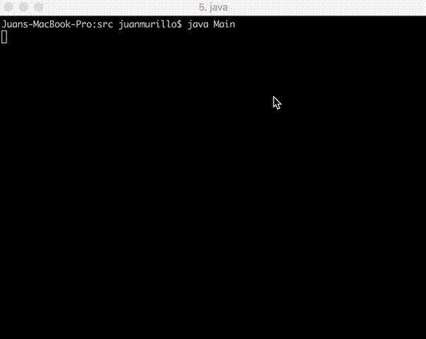

# psl-refactoring
This is a parser from raw numbers to LCD display numbers



## Instructions 

* Clone the repo 
```
git clone https://github.com/jgmurillo10/psl-refactoring.git
```

* Open your terminal and run

```
cd psl-refactoring/src
javac Main.java
java Main

```

* Play with the parser

The parser receives one line string `n,m`where `n` is the size of the output and `m` is the integer number we want to parse.

```
1,24224

 -           -     -
  |   | |     |     |   | |
 -     -     -     -     -
|       |   |     |       |
 -           -     -

```

* Stop the execution

If you want to stop the execution just type `0,0`

<hr>

Also, you can import the project into your favorite IDE and run the Main class)